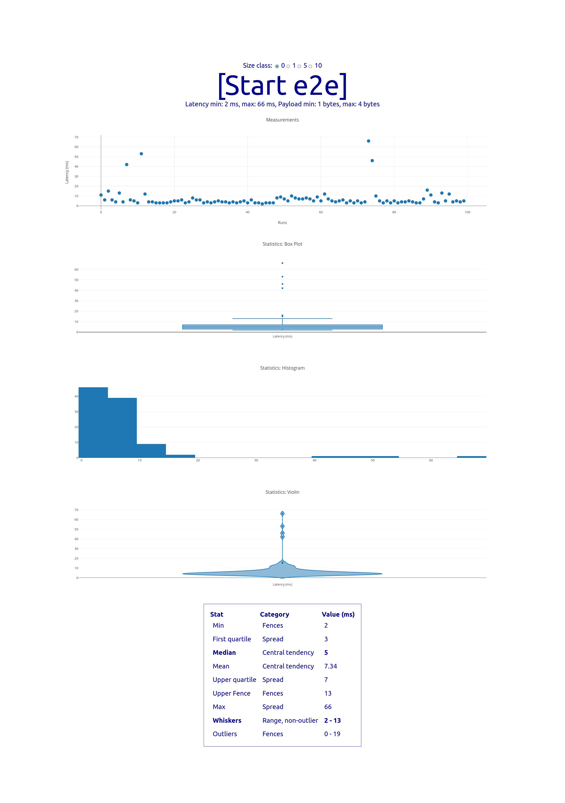
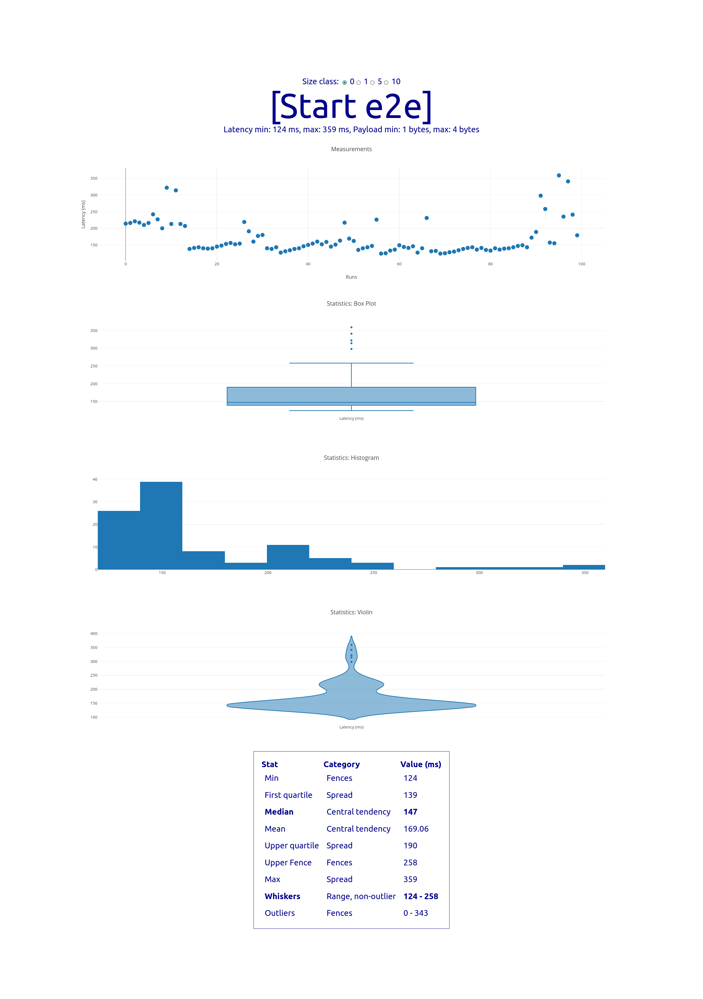

# End-to-end Fluid / Property Tree Benchmark

Property set operation speed benchmark. Evaluating the end-to-end latency associated w/ the roundtrip, for both local (ie. [Tinylicious](https://github.com/microsoft/FluidFramework/tree/main/server/tinylicious)) and remote (ie. [Fluid](https://docs.microsoft.com/en-us/azure/azure-fluid-relay/)) relay services.

Uses behind the scenes the [shared-property-map](https://github.com/dstanesc/shared-property-map) library.


## Fluid Relay Env Setup
```bash
export FLUID_MODE=frs
export SECRET_FLUID_RELAY=https://us.fluidrelay.azure.com
export SECRET_FLUID_TOKEN=xyz
export SECRET_FLUID_TENANT=xyz
```

## Tinylicious Env Setup

```bash
export FLUID_MODE=tiny
```

## Start

When using local relay, start the `tinylicious` service

```
npx tinylicious
```


```
npm run clean // optional
npm install
npm run build
npm start
```

## Example Results

Local (Tinylicious)



Remote (FRS)


